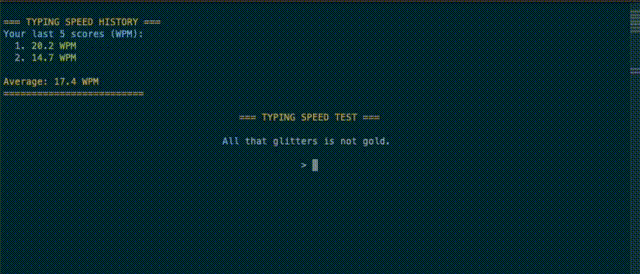

# Go-Type
The prettiest speed typing game in the terminal. 



## Short Description

I made this mini game because 2 major features were missing from other tools.
1. The ability to customize the sentences
2. When I make a mistake I want the whole word to be removed, so that I'll have to type it again (for muscle memory)

Also it's lightweight and open source, do we need anything else?

## Features

- Highlighting the current word
- Calculates WPM (word per minute) after each word (pressing space)
- Saves WPM for each quote finished
- Displays the 5 last WPMs with the avarage

## Future Features

- Adding the current high score
- Adding the ability to enter your own quotes without accessing the code
- Adding save to file to save your history for ever
- Adding the ability to track your fastest keys / words and your most mistakes for keys / words
- Multiplayer / Online scoreboard (probably won't happen)

---

## Installation

Clone the repo and then run the following command

```bash
go run .
```

if you want to build the binary

```bash
go build .
```

and then run the executable

